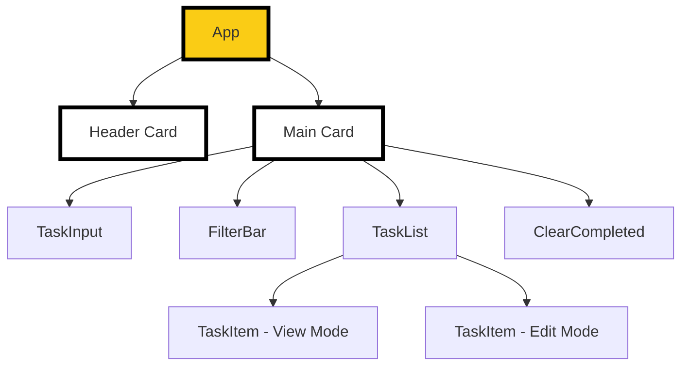

# Design Document: neobrutalism-styling

## Overview

Fitur ini menerapkan visual styling bergaya **Neobrutalism** pada aplikasi todolist yang sudah ada. Tidak ada perubahan pada logika bisnis, state management, atau struktur komponen — hanya penambahan Tailwind CSS utility classes pada elemen-elemen yang sudah ada.

### Prinsip Neobrutalism

Neobrutalism adalah gaya desain UI yang terinspirasi dari Brutalism arsitektur — raw, tegas, dan tidak menyembunyikan strukturnya. Ciri khasnya:

- **Border hitam tebal** — semua elemen interaktif memiliki `border-black` dengan ketebalan minimal `border-2`
- **Hard shadow** — `box-shadow` dengan offset solid tanpa blur, menciptakan ilusi kedalaman yang tajam
- **Press effect** — tombol "terasa" ditekan: shadow hilang dan elemen bergeser ke arah shadow saat hover/active
- **Warna kontras** — background kuning terang, aksen pink, teks hitam
- **Tipografi bold** — `font-mono`, `uppercase`, `font-black` untuk heading, `font-bold` untuk label
- **Mobile-first** — layout responsif mulai dari 320px

### Batasan Implementasi

- Seluruh styling menggunakan **Tailwind CSS utility classes** — tidak ada custom CSS, inline style, atau CSS Modules
- Tidak ada perubahan pada props, state, atau logika komponen
- Tidak ada dependensi baru yang ditambahkan

---

## Architecture

Karena ini adalah fitur styling murni, tidak ada perubahan arsitektur. Komponen yang ada dimodifikasi hanya pada bagian `className`.



Semua komponen menerima styling melalui `className` prop pada elemen JSX — tidak ada context, theme provider, atau CSS variables yang dibutuhkan.

---

## Components and Interfaces

Tidak ada perubahan pada interface komponen. Semua props tetap sama persis seperti implementasi sebelumnya.

### Komponen yang Dimodifikasi

| Komponen | File | Perubahan |
| --- | --- | --- |
| `App` | `src/App.tsx` | Tambah className pada wrapper div, header card, main card |
| `TaskInput` | `src/components/TaskInput/TaskInput.tsx` | Tambah className pada input, button, error span |
| `FilterBar` | `src/components/FilterBar/FilterBar.tsx` | Tambah className pada container div dan setiap button |
| `TaskItem` | `src/components/TaskItem/TaskItem.tsx` | Tambah className pada li, input, span, button (view + edit mode) |
| `TaskList` | `src/components/TaskList/TaskList.tsx` | Tambah className pada ul dan empty state paragraph |
| `ClearCompleted` | `src/components/ClearCompleted/ClearCompleted.tsx` | Tambah className pada button (active + disabled state) |

---

## Data Models

Tidak ada perubahan pada data model. `Task`, `FilterType`, dan semua interface tetap sama.

---

## Design Tokens

Design tokens adalah pola visual yang digunakan secara konsisten di seluruh aplikasi.

### Color Palette

| Token | Tailwind Class | Hex | Penggunaan |
| --- | --- | --- | --- |
| Background utama | `bg-yellow-300` | `#fde047` | Halaman penuh (App wrapper) |
| Background card | `bg-white` | `#ffffff` | Header card, main card, task item |
| Background input fokus | `bg-yellow-100` | `#fef9c3` | Input field saat fokus |
| Aksen filter aktif | `bg-pink-400` | `#f472b6` | Tombol filter yang dipilih |
| Tombol primer | `bg-black` | `#000000` | Tombol Tambah, Simpan |
| Teks tombol primer | `text-yellow-300` | `#fde047` | Teks pada bg-black button |
| Border universal | `border-black` | `#000000` | Semua elemen interaktif |
| Error background | `bg-red-50` | `#fef2f2` | Pesan error |
| Error border/teks | `border-red-600 text-red-600` | `#dc2626` | Pesan error |
| Tombol hapus aksen | `bg-red-500` | `#ef4444` | Tombol Hapus pada TaskItem |

### Hard Shadow Variants

| Nama | Tailwind Class | Penggunaan |
| --- | --- | --- |
| Shadow besar | `shadow-[6px_6px_0px_0px_#000]` | Header card, main card |
| Shadow medium | `shadow-[4px_4px_0px_0px_#000]` | Tombol Edit, Hapus, Batal |
| Shadow kuning | `shadow-[4px_4px_0px_0px_#facc15]` | Tombol Tambah, Simpan (bg-black) |
| Shadow filter | `shadow-[3px_3px_0px_0px_#000]` | Tombol filter tidak aktif |

### Press Effect Pattern

Semua tombol interaktif menggunakan pola ini:

```
hover:shadow-none hover:translate-x-[n] hover:translate-y-[n]
active:shadow-none active:translate-x-[n] active:translate-y-[n]
transition-all
```

Nilai translate disesuaikan dengan besar shadow:
- Shadow 6px → `translate-x-1.5 translate-y-1.5`
- Shadow 4px → `translate-x-1 translate-y-1`
- Shadow 3px → `translate-x-0.5 translate-y-0.5`

### Border Style

```
border-4 border-black   ← card, input, tombol primer
border-2 border-black   ← task item row, tombol sekunder
```

### Typography Pattern

```
font-mono               ← font utama seluruh App
font-black uppercase    ← heading (h1)
font-bold uppercase     ← label tombol, filter
font-bold               ← teks input, error message
```

---

## Per-Komponen Design Spec

### App

Layout utama aplikasi dengan dua card: header dan main content.

```
<div className="min-h-screen bg-yellow-300 p-4 sm:p-8 font-mono">
  <div className="max-w-lg mx-auto">

    {/* Header Card */}
    <div className="border-4 border-black bg-white shadow-[6px_6px_0px_0px_#000] mb-6 p-4">
      <h1 className="text-3xl font-black uppercase tracking-tight text-black">
        📝 Todo List
      </h1>
      <p className="text-sm font-bold text-black/60 mt-1">
        Catat. Selesaikan. Hapus.
      </p>
    </div>

    {/* Main Card */}
    <div className="border-4 border-black bg-white shadow-[6px_6px_0px_0px_#000] p-5 flex flex-col gap-5">
      {/* TaskInput, FilterBar, TaskList, ClearCompleted */}
    </div>

  </div>
</div>
```

**Keputusan desain:**
- `mb-6` antara header dan main card memberikan breathing room
- `gap-5` pada main card memisahkan setiap komponen secara konsisten
- `p-4 sm:p-8` memberikan padding responsif pada wrapper luar

---

### TaskInput

Form tambah task dengan input field dan tombol aksi.

```
{/* Container */}
<div className="flex flex-col gap-1">

  {/* Row input + button */}
  <div className="flex gap-2">

    {/* Input field */}
    <input
      className="flex-1 px-3 py-2 border-4 border-black font-mono font-bold text-sm
                 bg-white placeholder:text-black/40
                 focus:outline-none focus:bg-yellow-100 transition-colors"
    />

    {/* Tombol Tambah */}
    <button
      className="px-4 py-2 bg-black text-yellow-300 font-black text-sm uppercase
                 border-4 border-black shadow-[4px_4px_0px_0px_#facc15]
                 hover:shadow-none hover:translate-x-1 hover:translate-y-1
                 active:shadow-none active:translate-x-1 active:translate-y-1
                 transition-all"
    >
      + Tambah
    </button>

  </div>

  {/* Error state */}
  {error && (
    <span
      role="alert"
      className="text-sm font-bold text-red-600 border-2 border-red-600 bg-red-50 px-2 py-1"
    >
      ⚠ {error}
    </span>
  )}

</div>
```

**Keputusan desain:**
- Shadow kuning (`#facc15`) pada tombol Tambah menciptakan kontras yang kuat dengan bg-black
- `flex-1` pada input memastikan input mengisi sisa ruang
- Error state menggunakan `border-2` (lebih tipis dari `border-4`) agar tidak terlalu dominan

---

### FilterBar

Tiga tombol filter dengan state aktif/tidak aktif yang jelas.

```
{/* Container */}
<div role="group" aria-label="Filter tugas" className="flex gap-2">

  {/* Tombol tidak aktif */}
  <button
    className="flex-1 px-3 py-2 text-sm font-black uppercase border-4 border-black
               bg-white text-black shadow-[3px_3px_0px_0px_#000]
               hover:shadow-none hover:translate-x-0.5 hover:translate-y-0.5
               active:shadow-none active:translate-x-0.5 active:translate-y-0.5
               transition-all"
  />

  {/* Tombol aktif (Active_Filter) */}
  <button
    className="flex-1 px-3 py-2 text-sm font-black uppercase border-4 border-black
               bg-pink-400 text-black shadow-none translate-x-0.5 translate-y-0.5
               transition-all"
  />

</div>
```

**Keputusan desain:**
- `flex-1` pada semua tombol memastikan lebar konsisten — tidak ada layout shift saat state berubah
- Tombol aktif menggunakan `shadow-none translate-x-0.5 translate-y-0.5` secara permanen (bukan hanya saat hover) untuk menunjukkan "sedang ditekan"
- Shadow filter lebih kecil (3px) dibanding card (6px) untuk hierarki visual

---

### TaskItem — View Mode

Baris task dengan checkbox, judul, dan tombol aksi.

```
{/* Task row */}
<li className="flex items-center gap-3 p-3 border-2 border-black bg-white
               hover:bg-yellow-50 transition-colors">

  {/* Checkbox */}
  <input
    type="checkbox"
    className="w-5 h-5 border-2 border-black accent-black cursor-pointer flex-shrink-0"
  />

  {/* Judul — normal */}
  <span className="flex-1 font-bold text-sm text-black">
    {task.title}
  </span>

  {/* Judul — completed */}
  <span className="flex-1 font-bold text-sm text-black line-through opacity-60"
        data-completed={task.completed}>
    {task.title}
  </span>

  {/* Tombol Edit */}
  <button
    className="px-2 py-1 text-xs font-black uppercase border-2 border-black bg-white
               shadow-[3px_3px_0px_0px_#000]
               hover:shadow-none hover:translate-x-0.5 hover:translate-y-0.5
               active:shadow-none active:translate-x-0.5 active:translate-y-0.5
               transition-all"
  >
    Edit
  </button>

  {/* Tombol Hapus */}
  <button
    className="px-2 py-1 text-xs font-black uppercase border-2 border-black bg-red-500 text-white
               shadow-[3px_3px_0px_0px_#000]
               hover:shadow-none hover:translate-x-0.5 hover:translate-y-0.5
               active:shadow-none active:translate-x-0.5 active:translate-y-0.5
               transition-all"
  >
    Hapus
  </button>

</li>
```

**Keputusan desain:**
- `hover:bg-yellow-50` pada baris memberikan feedback hover yang halus tanpa mengganggu
- Tombol Hapus menggunakan `bg-red-500 text-white` untuk membedakan dari tombol Edit secara jelas
- `flex-shrink-0` pada checkbox mencegah checkbox mengecil pada judul panjang

---

### TaskItem — Edit Mode

Input edit dengan tombol Simpan dan Batal.

```
{/* Edit row */}
<li className="flex flex-col gap-2 p-3 border-2 border-black bg-yellow-50">

  {/* Input edit */}
  <input
    type="text"
    className="w-full px-3 py-2 border-4 border-black font-mono font-bold text-sm bg-white
               focus:outline-none focus:bg-yellow-100 transition-colors"
  />

  {/* Tombol aksi */}
  <div className="flex gap-2">

    {/* Tombol Simpan */}
    <button
      className="flex-1 px-3 py-1.5 text-xs font-black uppercase border-2 border-black
                 bg-black text-yellow-300 shadow-[3px_3px_0px_0px_#facc15]
                 hover:shadow-none hover:translate-x-0.5 hover:translate-y-0.5
                 active:shadow-none active:translate-x-0.5 active:translate-y-0.5
                 transition-all"
    >
      Simpan
    </button>

    {/* Tombol Batal */}
    <button
      className="flex-1 px-3 py-1.5 text-xs font-black uppercase border-2 border-black
                 bg-white text-black shadow-[3px_3px_0px_0px_#000]
                 hover:shadow-none hover:translate-x-0.5 hover:translate-y-0.5
                 active:shadow-none active:translate-x-0.5 active:translate-y-0.5
                 transition-all"
    >
      Batal
    </button>

  </div>

  {/* Error state */}
  {error && (
    <span
      role="alert"
      className="text-sm font-bold text-red-600 border-2 border-red-600 bg-red-50 px-2 py-1"
    >
      ⚠ {error}
    </span>
  )}

</li>
```

**Keputusan desain:**
- Background `bg-yellow-50` pada edit mode membedakan secara visual dari view mode
- Tombol Simpan menggunakan pola yang sama dengan tombol Tambah (bg-black + shadow kuning) untuk konsistensi
- Error styling identik dengan TaskInput untuk konsistensi sistem

---

### TaskList

Container daftar task dan empty state.

```
{/* Empty state */}
<p className="text-center font-bold uppercase text-black/40 py-8 tracking-widest">
  Belum ada tugas
</p>

{/* List container */}
<ul className="flex flex-col gap-2 list-none p-0 m-0">
  {tasks.map(task => <TaskItem ... />)}
</ul>
```

**Keputusan desain:**
- `gap-2` antara task item memberikan separasi visual yang cukup tanpa terlalu renggang
- Empty state menggunakan `text-black/40` (opacity 40%) agar tidak terlalu mencolok
- `tracking-widest` pada empty state memberikan kesan "placeholder" yang khas

---

### ClearCompleted

Tombol hapus semua task selesai dengan dua state visual.

```
{/* State aktif — hasCompleted = true */}
<button
  className="w-full px-4 py-2 text-sm font-black uppercase border-4 border-black
             bg-white text-black shadow-[4px_4px_0px_0px_#000]
             hover:shadow-none hover:translate-x-1 hover:translate-y-1
             active:shadow-none active:translate-x-1 active:translate-y-1
             transition-all"
>
  Hapus Semua Selesai
</button>

{/* State tidak aktif — hasCompleted = false */}
<button
  disabled
  className="w-full px-4 py-2 text-sm font-black uppercase border-4 border-black
             bg-white text-black opacity-50 cursor-not-allowed"
>
  Hapus Semua Selesai
</button>
```

**Keputusan desain:**
- `w-full` memastikan tombol mudah ditemukan di bagian bawah card
- State tidak aktif menghilangkan shadow dan press effect — tidak ada interaksi visual
- `cursor-not-allowed` memberikan feedback yang jelas bahwa tombol tidak bisa diklik

---

## Correctness Properties

*A property is a characteristic or behavior that should hold true across all valid executions of a system — essentially, a formal statement about what the system should do. Properties serve as the bridge between human-readable specifications and machine-verifiable correctness guarantees.*

Fitur ini adalah styling murni, namun beberapa properti visual dapat diverifikasi secara universal karena berlaku untuk semua instance komponen yang dirender — bukan hanya contoh spesifik. Property-based testing di sini menggunakan fast-check untuk menghasilkan berbagai kombinasi props dan memverifikasi bahwa class CSS yang diharapkan selalu ada.

### Property 1: Semua tombol interaktif memiliki Press Effect

*For any* tombol interaktif yang dirender oleh komponen manapun (TaskInput, FilterBar, TaskItem, ClearCompleted), tombol tersebut harus memiliki class `hover:shadow-none` yang menandakan Press Effect diterapkan.

**Validates: Requirements 2.4, 3.3, 4.4, 4.5, 5.3, 5.4, 7.1, 8.5**

---

### Property 2: Tombol filter aktif selalu menggunakan warna pink

*For any* nilai filter yang dipilih (`all`, `active`, atau `completed`), tombol yang sesuai dengan filter tersebut harus memiliki class `bg-pink-400`, dan tombol lainnya tidak boleh memiliki class tersebut.

**Validates: Requirements 3.4, 8.3**

---

### Property 3: Task completed selalu ditampilkan dengan line-through dan opacity berkurang

*For any* task dengan `completed = true`, elemen span yang menampilkan judul task harus memiliki class `line-through` dan `opacity-60`.

**Validates: Requirements 4.3**

---

### Property 4: Pesan error selalu menggunakan styling merah yang konsisten

*For any* string input yang tidak valid (kosong atau hanya whitespace) yang disubmit ke TaskInput atau TaskItem edit mode, pesan error yang muncul harus memiliki class `text-red-600`, `border-red-600`, dan `bg-red-50`.

**Validates: Requirements 2.5, 5.5**

---

### Property 5: Semua elemen interaktif memiliki border hitam

*For any* elemen interaktif (input field, tombol, card) yang dirender, elemen tersebut harus memiliki class `border-black` dengan ketebalan minimal `border-2`.

**Validates: Requirements 8.4**

---

## Error Handling

Tidak ada error handling baru yang dibutuhkan — fitur ini hanya styling. Error handling yang sudah ada (validasi input, storage error) tetap tidak berubah.

Satu-satunya pertimbangan error adalah **Tailwind class purging**: semua class yang digunakan secara dinamis (seperti conditional class pada filter aktif/tidak aktif) harus ditulis secara lengkap sebagai string literal agar tidak di-purge oleh Tailwind pada production build.

**Pola yang benar:**
```tsx
// ✅ Class lengkap — tidak akan di-purge
className={isActive ? 'bg-pink-400 shadow-none' : 'bg-white shadow-[3px_3px_0px_0px_#000]'}

// ❌ Class dinamis — bisa di-purge
className={`bg-${isActive ? 'pink-400' : 'white'}`}
```

---

## Testing Strategy

### Pendekatan

Fitur styling menggunakan dua pendekatan testing:

1. **Unit tests (example-based)**: Memverifikasi class CSS spesifik pada state tertentu (render awal, state aktif, state disabled)
2. **Property-based tests**: Memverifikasi properti visual yang berlaku universal untuk semua kombinasi props

### Library

- **Test runner**: [Vitest](https://vitest.dev/)
- **Component testing**: [React Testing Library](https://testing-library.com/docs/react-testing-library/intro/)
- **Property-based testing**: [fast-check](https://fast-check.dev/) — minimum 100 iterasi per property test

### Struktur Test

Test styling ditambahkan ke file test yang sudah ada:

```
src/components/
  TaskInput/TaskInput.test.tsx     ← tambah: styling tests
  FilterBar/FilterBar.test.tsx     ← tambah: styling tests
  TaskItem/TaskItem.test.tsx       ← tambah: styling tests
  TaskList/TaskList.test.tsx       ← tambah: styling tests
  ClearCompleted/ClearCompleted.test.tsx  ← tambah: styling tests
App.test.tsx                       ← tambah: layout styling tests
```

### Property-Based Tests

Setiap property test menggunakan `fc.assert(fc.property(...))` dengan minimum **100 iterasi**.

Tag format: `// Feature: neobrutalism-styling, Property N: <deskripsi>`

Contoh implementasi Property 2:

```typescript
import * as fc from 'fast-check';
import { render, screen } from '@testing-library/react';
import { FilterBar } from './FilterBar';

// Feature: neobrutalism-styling, Property 2: Tombol filter aktif selalu menggunakan warna pink
test('tombol filter aktif selalu memiliki bg-pink-400', () => {
  const filters = ['all', 'active', 'completed'] as const;
  fc.assert(
    fc.property(
      fc.constantFrom(...filters),
      (activeFilter) => {
        const { unmount } = render(
          <FilterBar currentFilter={activeFilter} onFilterChange={() => {}} />
        );
        const buttons = screen.getAllByRole('button');
        const activeButton = buttons.find(
          btn => btn.getAttribute('aria-pressed') === 'true'
        );
        expect(activeButton).toHaveClass('bg-pink-400');
        buttons
          .filter(btn => btn !== activeButton)
          .forEach(btn => expect(btn).not.toHaveClass('bg-pink-400'));
        unmount();
      }
    )
  );
});
```

Contoh implementasi Property 3:

```typescript
import * as fc from 'fast-check';
import { render } from '@testing-library/react';
import { TaskItem } from './TaskItem';

// Feature: neobrutalism-styling, Property 3: Task completed selalu ditampilkan dengan line-through
test('task completed selalu memiliki class line-through dan opacity-60', () => {
  fc.assert(
    fc.property(
      fc.record({
        id: fc.uuid(),
        title: fc.string({ minLength: 1 }).filter(s => s.trim().length > 0),
        completed: fc.constant(true),
        createdAt: fc.integer({ min: 0 }),
      }),
      (task) => {
        const { unmount } = render(
          <TaskItem
            task={task}
            isEditing={false}
            onToggle={() => {}}
            onEdit={() => {}}
            onSave={() => {}}
            onCancel={() => {}}
            onDelete={() => {}}
          />
        );
        const titleSpan = document.querySelector('[data-completed="true"]');
        expect(titleSpan).toHaveClass('line-through');
        expect(titleSpan).toHaveClass('opacity-60');
        unmount();
      }
    )
  );
});
```

### Unit Tests (Example-Based)

Unit tests fokus pada:
- Render awal setiap komponen — verifikasi class utama ada
- State aktif vs tidak aktif (FilterBar, ClearCompleted)
- View mode vs edit mode (TaskItem)
- Error state (TaskInput, TaskItem edit mode)

### Cakupan per Requirement

| Requirement | Tipe Test | Property |
| --- | --- | --- |
| 1.1–1.6 Layout & tema global | Example | — |
| 2.1–2.3 TaskInput styling | Example | — |
| 2.4 Press Effect tombol tambah | Property | Property 1 |
| 2.5 Error state TaskInput | Property | Property 4 |
| 3.1–3.3 FilterBar inactive | Property | Property 1, 5 |
| 3.4 FilterBar active | Property | Property 2 |
| 3.5 Lebar konsisten | Example | — |
| 4.1–4.2 TaskItem view mode | Property | Property 5 |
| 4.3 Completed task styling | Property | Property 3 |
| 4.4–4.5 Tombol Edit & Hapus | Property | Property 1 |
| 4.6 Hover feedback | Example | — |
| 5.1–5.2 Edit mode input | Property | Property 5 |
| 5.3–5.4 Tombol Simpan & Batal | Property | Property 1 |
| 5.5 Error state edit mode | Property | Property 4 |
| 6.1–6.3 TaskList | Example | — |
| 7.1–7.3 ClearCompleted | Example | Property 1 |
| 8.1 Tailwind only | Smoke | — |
| 8.2–8.3 Warna konsisten | Property | Property 2 |
| 8.4 Border hitam universal | Property | Property 5 |
| 8.5 Press Effect universal | Property | Property 1 |
| 8.6 Transition | Example | — |
| 8.7 Uppercase + font bold | Example | — |
| 8.8 Responsif | Smoke | — |
