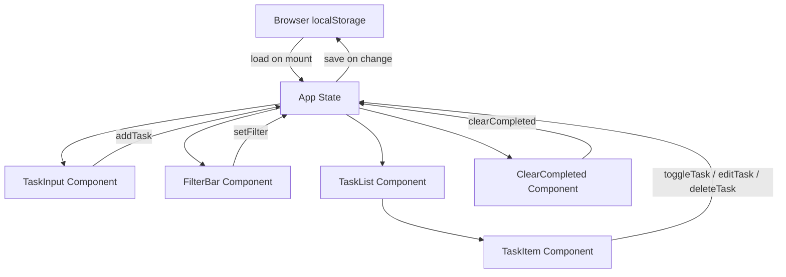

# Design Document: todolist-app

## Overview

Aplikasi **todolist-app** adalah aplikasi frontend berbasis browser yang memungkinkan pengguna mengelola daftar tugas secara lokal. Aplikasi ini berjalan sepenuhnya di sisi klien (client-side only) tanpa memerlukan backend atau koneksi internet, dengan data yang dipersistensikan menggunakan `localStorage`.

### Tujuan Utama

- Menyediakan antarmuka yang sederhana dan responsif untuk manajemen tugas
- Mendukung operasi CRUD penuh: tambah, baca, edit, hapus tugas
- Mempertahankan data antar sesi browser melalui `localStorage`
- Mendukung filtering tugas berdasarkan status

### Teknologi

- **Bahasa**: TypeScript
- **Framework UI**: React (dengan Vite sebagai build tool)
- **State Management**: React `useState` + `useReducer` (lokal, tanpa library eksternal)
- **Persistensi**: Browser `localStorage` API
- **Testing**: Vitest + React Testing Library + fast-check (property-based testing)
- **Styling**: CSS Modules atau Tailwind CSS

---

## Architecture

Aplikasi menggunakan arsitektur **single-page application (SPA)** dengan pola **unidirectional data flow**. Semua state dikelola di komponen root (`App`) dan diteruskan ke bawah melalui props.



### Alur Data

1. Saat aplikasi dimuat, `useEffect` membaca data dari `localStorage` dan menginisialisasi state
2. Setiap perubahan state (tambah/edit/hapus/toggle) memicu `useEffect` lain yang menyimpan state terbaru ke `localStorage`
3. Komponen UI hanya menerima data dan callback — tidak mengakses `localStorage` secara langsung

---

## Components and Interfaces

### Komponen Utama

#### `App`
Komponen root yang memegang seluruh state aplikasi.

```typescript
interface AppState {
  tasks: Task[];
  filter: FilterType;
  editingTaskId: string | null;
}
```

#### `TaskInput`
Form untuk menambahkan tugas baru.

```typescript
interface TaskInputProps {
  onAdd: (title: string) => void;
}
```

#### `FilterBar`
Tombol filter untuk memilih tampilan tugas.

```typescript
interface FilterBarProps {
  currentFilter: FilterType;
  onFilterChange: (filter: FilterType) => void;
}
```

#### `TaskList`
Menampilkan daftar tugas yang sudah difilter.

```typescript
interface TaskListProps {
  tasks: Task[];
  editingTaskId: string | null;
  onToggle: (id: string) => void;
  onEdit: (id: string) => void;
  onSave: (id: string, newTitle: string) => void;
  onCancel: () => void;
  onDelete: (id: string) => void;
}
```

#### `TaskItem`
Menampilkan satu item tugas dengan aksi yang tersedia.

```typescript
interface TaskItemProps {
  task: Task;
  isEditing: boolean;
  onToggle: (id: string) => void;
  onEdit: (id: string) => void;
  onSave: (id: string, newTitle: string) => void;
  onCancel: () => void;
  onDelete: (id: string) => void;
}
```

#### `ClearCompleted`
Tombol untuk menghapus semua tugas selesai.

```typescript
interface ClearCompletedProps {
  hasCompleted: boolean;
  onClear: () => void;
}
```

### Fungsi Logika Inti (Pure Functions)

Logika bisnis dipisahkan ke dalam modul `taskUtils.ts` agar mudah diuji:

```typescript
// src/utils/taskUtils.ts

export function addTask(tasks: Task[], title: string): Task[]
export function toggleTask(tasks: Task[], id: string): Task[]
export function editTask(tasks: Task[], id: string, newTitle: string): Task[]
export function deleteTask(tasks: Task[], id: string): Task[]
export function clearCompleted(tasks: Task[]): Task[]
export function filterTasks(tasks: Task[], filter: FilterType): Task[]
export function validateTitle(title: string): boolean
```

### Fungsi Storage

```typescript
// src/utils/storage.ts

export function saveTasks(tasks: Task[]): void
export function loadTasks(): Task[]
```

---

## Data Models

### `Task`

```typescript
interface Task {
  id: string;          // UUID unik, dibuat saat task ditambahkan
  title: string;       // Judul tugas, tidak boleh kosong atau hanya spasi
  completed: boolean;  // Status: false = belum selesai, true = selesai
  createdAt: number;   // Unix timestamp (Date.now()) saat task dibuat
}
```

### `FilterType`

```typescript
type FilterType = 'all' | 'active' | 'completed';
```

### Format Penyimpanan di `localStorage`

Data disimpan dengan key `"todolist-app-tasks"` dalam format JSON array:

```json
[
  {
    "id": "uuid-v4-string",
    "title": "Beli bahan makanan",
    "completed": false,
    "createdAt": 1700000000000
  }
]
```

### Aturan Validasi

- `title` setelah di-trim tidak boleh berupa string kosong (`""`)
- `id` harus unik di seluruh `Task_List`
- `createdAt` adalah timestamp immutable yang tidak berubah setelah task dibuat

---

## Correctness Properties

*A property is a characteristic or behavior that should hold true across all valid executions of a system — essentially, a formal statement about what the system should do. Properties serve as the bridge between human-readable specifications and machine-verifiable correctness guarantees.*

### Property 1: Penambahan task yang valid selalu masuk ke list

*For any* task list dan judul task yang valid (non-empty setelah di-trim), memanggil `addTask` harus menghasilkan task list baru yang panjangnya bertambah satu, dan task baru tersebut memiliki judul yang sesuai serta status `completed = false`.

**Validates: Requirements 1.2**

---

### Property 2: Validasi judul menolak semua string whitespace

*For any* string yang seluruhnya terdiri dari whitespace characters (spasi, tab, newline, atau kombinasinya), fungsi `validateTitle` harus mengembalikan `false`, dan operasi tambah maupun edit task tidak boleh mengubah task list.

**Validates: Requirements 1.4, 4.3**

---

### Property 3: Urutan tampilan task adalah descending berdasarkan waktu pembuatan

*For any* task list dengan dua atau lebih task, fungsi yang menghasilkan urutan tampilan harus menghasilkan list di mana setiap task memiliki `createdAt` lebih besar atau sama dengan task berikutnya (terbaru di atas).

**Validates: Requirements 2.1**

---

### Property 4: Render task mengandung judul dan indikator status yang benar

*For any* task (baik `completed = true` maupun `completed = false`), output render `TaskItem` harus mengandung judul task dan indikator visual yang sesuai dengan status task tersebut.

**Validates: Requirements 2.3, 3.3**

---

### Property 5: Toggle status task adalah operasi round-trip

*For any* task list dan task id yang valid, memanggil `toggleTask` dua kali berturut-turut pada task yang sama harus menghasilkan task list yang identik dengan task list awal (status kembali ke nilai semula).

**Validates: Requirements 3.1, 3.2**

---

### Property 6: Edit task memperbarui judul dengan benar

*For any* task list, task id yang valid, dan judul baru yang valid, memanggil `editTask` harus menghasilkan task list di mana hanya task yang ditarget yang judulnya berubah, sementara semua field lain (id, completed, createdAt) dan semua task lain tetap tidak berubah.

**Validates: Requirements 4.2**

---

### Property 7: Pembatalan edit tidak mengubah task list

*For any* task list, memulai mode edit lalu membatalkan (cancel) harus menghasilkan task list yang identik dengan task list sebelum edit dimulai.

**Validates: Requirements 4.4**

---

### Property 8: Hapus task mengurangi list tepat satu elemen

*For any* task list dengan minimal satu task, memanggil `deleteTask` dengan id yang valid harus menghasilkan task list yang panjangnya berkurang tepat satu, dan task dengan id tersebut tidak boleh ada di list hasil.

**Validates: Requirements 5.1**

---

### Property 9: Filter task mengembalikan subset yang benar

*For any* task list dan filter type (`all`, `active`, atau `completed`):
- Filter `all` harus mengembalikan semua task (panjang sama dengan input)
- Filter `active` harus mengembalikan hanya task dengan `completed = false`
- Filter `completed` harus mengembalikan hanya task dengan `completed = true`

**Validates: Requirements 6.2, 6.3, 6.4**

---

### Property 10: clearCompleted menghapus semua task selesai dan hanya task selesai

*For any* task list, memanggil `clearCompleted` harus menghasilkan task list di mana tidak ada task dengan `completed = true`, dan semua task dengan `completed = false` dari list awal tetap ada.

**Validates: Requirements 7.2**

---

### Property 11: Persistensi storage adalah operasi round-trip

*For any* task list yang valid, memanggil `saveTasks` diikuti `loadTasks` harus menghasilkan task list yang secara struktural identik dengan task list yang disimpan.

**Validates: Requirements 8.1, 8.2**

---

## Error Handling

### Validasi Input

| Kondisi | Penanganan |
|---|---|
| Judul kosong atau hanya spasi saat tambah | Tampilkan pesan error inline, jangan tambahkan task |
| Judul kosong atau hanya spasi saat edit | Tampilkan pesan error inline, jangan simpan perubahan |
| Task id tidak ditemukan saat toggle/edit/delete | Kembalikan task list tidak berubah (no-op) |

### Error Storage

| Kondisi | Penanganan |
|---|---|
| `localStorage` tidak tersedia (private mode, quota exceeded) | Tangkap exception, log ke console, lanjutkan tanpa persistensi |
| Data di `localStorage` corrupt / bukan JSON valid | Tangkap exception dari `JSON.parse`, inisialisasi dengan array kosong |
| Data di `localStorage` ada tapi bukan array | Validasi tipe, fallback ke array kosong |

### Prinsip Umum

- Semua fungsi pure di `taskUtils.ts` tidak boleh throw exception — kembalikan state tidak berubah jika input tidak valid
- Fungsi storage (`saveTasks`, `loadTasks`) boleh gagal secara silent — aplikasi tetap berfungsi tanpa persistensi
- Tidak ada operasi async — semua operasi bersifat synchronous

---

## Testing Strategy

### Pendekatan Dual Testing

Pengujian menggunakan dua pendekatan komplementer:

1. **Unit tests (example-based)**: Memverifikasi perilaku spesifik dengan contoh konkret, edge case, dan kondisi error
2. **Property-based tests**: Memverifikasi properti universal yang berlaku untuk semua input yang valid

### Library

- **Test runner**: [Vitest](https://vitest.dev/)
- **React testing**: [React Testing Library](https://testing-library.com/docs/react-testing-library/intro/)
- **Property-based testing**: [fast-check](https://fast-check.dev/) — library PBT untuk JavaScript/TypeScript

### Struktur Test

```
src/
  utils/
    taskUtils.ts
    taskUtils.test.ts       ← unit + property tests untuk pure functions
    storage.ts
    storage.test.ts         ← unit tests untuk storage functions
  components/
    TaskItem/
      TaskItem.test.tsx     ← unit tests untuk rendering
    TaskInput/
      TaskInput.test.tsx
    FilterBar/
      FilterBar.test.tsx
    TaskList/
      TaskList.test.tsx
  App.test.tsx              ← integration tests
```

### Property-Based Tests

Setiap property test menggunakan `fc.assert(fc.property(...))` dari fast-check dengan minimum **100 iterasi** (default fast-check).

Setiap test diberi tag komentar dengan format:
```
// Feature: todolist-app, Property N: <deskripsi singkat>
```

Contoh implementasi:

```typescript
import * as fc from 'fast-check';
import { addTask, validateTitle } from './taskUtils';

// Feature: todolist-app, Property 1: Penambahan task yang valid selalu masuk ke list
test('addTask dengan judul valid menambah satu task ke list', () => {
  fc.assert(
    fc.property(
      fc.array(taskArbitrary()),
      fc.string({ minLength: 1 }).filter(s => s.trim().length > 0),
      (tasks, title) => {
        const result = addTask(tasks, title);
        expect(result).toHaveLength(tasks.length + 1);
        expect(result.some(t => t.title === title.trim() && !t.completed)).toBe(true);
      }
    )
  );
});
```

### Unit Tests (Example-Based)

Unit tests fokus pada:
- Kasus edge: storage kosong, task list kosong, id tidak ditemukan
- Kondisi error: input tidak valid, localStorage tidak tersedia
- Integrasi komponen: render dengan berbagai kombinasi props

### Smoke Tests

- Verifikasi input field ada di DOM saat render awal
- Verifikasi tiga tombol filter ada di DOM

### Cakupan per Requirement

| Requirement | Tipe Test | Property |
|---|---|---|
| 1.2 Tambah task valid | Property | Property 1 |
| 1.4 Validasi whitespace (tambah) | Property | Property 2 |
| 2.1 Urutan tampilan | Property | Property 3 |
| 2.2 List kosong | Example | — |
| 2.3 Render judul & status | Property | Property 4 |
| 3.1 & 3.2 Toggle round-trip | Property | Property 5 |
| 4.2 Edit task | Property | Property 6 |
| 4.3 Validasi whitespace (edit) | Property | Property 2 |
| 4.4 Batal edit | Property | Property 7 |
| 5.1 Hapus task | Property | Property 8 |
| 6.2–6.4 Filter | Property | Property 9 |
| 7.2 Clear completed | Property | Property 10 |
| 8.1 & 8.2 Storage round-trip | Property | Property 11 |
| 8.3 Storage kosong | Example | — |
| 1.1 Input field ada | Smoke | — |
| 6.1 Filter buttons ada | Smoke | — |
